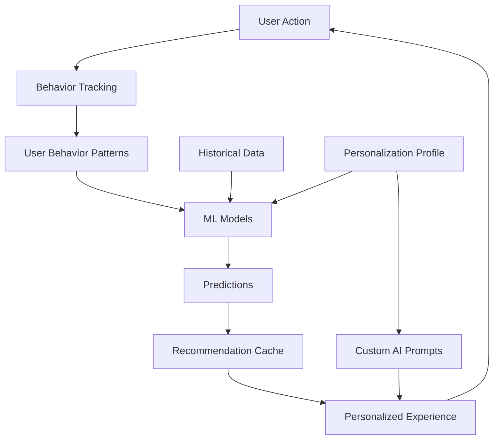

# Phase 5: Advanced AI Personalization & Machine Learning
## Implementation Status

**Status**: ✅ IMPLEMENTED  
**Date**: 2025-01-01  
**Version**: 1.0.0

---

## Overview

Phase 5 introduces advanced AI personalization and machine learning capabilities to the platform, enabling predictive analytics, personalized user experiences, and intelligent automation.

---

## Database Schema

### Core Tables (10 tables)

1. **ml_models** - ML model metadata and configurations
2. **prediction_results** - Prediction outcomes and accuracy tracking
3. **user_behavior_patterns** - Detailed behavioral tracking for ML
4. **personalization_profiles** - User-specific AI preferences
5. **content_performance_predictions** - Forecasted content metrics
6. **workflow_predictions** - Predicted workflow outcomes
7. **automation_triggers** - Smart automation rules
8. **recommendation_cache** - Personalized recommendations
9. **behavioral_analytics_sessions** - Detailed session tracking
10. **adaptive_ui_state** - Learned UI preferences

### Key Features

- **RLS Policies**: All tables have proper row-level security
- **Indexes**: Performance-optimized indexes on all key fields
- **Triggers**: Automatic timestamp updates
- **Foreign Keys**: Proper relationships with cascade deletes

---

## Core Services

### 1. ML Prediction Engine (`mlPredictionEngine.ts`)

**Features**:
- Content performance prediction
- Workflow duration forecasting
- SERP position prediction
- Historical data analysis
- Confidence scoring

**Key Methods**:
```typescript
predictContentPerformance(userId, keyword, contentId?)
predictWorkflowDuration(userId, workflowType)
predictSERPPosition(userId, keyword, contentId?)
```

### 2. Personalization Engine (`personalizationEngine.ts`)

**Features**:
- User profile management
- Personalized recommendations
- Behavior tracking
- Adaptive UI preferences
- Custom AI prompts

**Key Methods**:
```typescript
getPersonalizationProfile(userId)
generateRecommendations(userId, type)
trackBehavior(userId, patternType, patternData)
getUIPreferences(userId)
getPersonalizedPrompt(profile)
```

---

## Frontend Components

### PersonalizationDashboard

**Location**: `src/components/personalization/PersonalizationDashboard.tsx`

**Features**:
- Overview of personalization settings
- Prediction generation interface
- Personalized recommendations display
- Profile settings management

**Tabs**:
1. **Overview** - Personalization score and profile summary
2. **Predictions** - Generate and view ML predictions
3. **Recommendations** - AI-powered suggestions
4. **Settings** - Customize personalization preferences

---

## Implementation Details

### Prediction Models

#### Content Performance Prediction
- Uses historical analytics data
- Incorporates SERP difficulty analysis
- Calculates confidence intervals
- Identifies contributing factors

#### Workflow Duration Prediction
- Analyzes past workflow executions
- Identifies bottlenecks
- Calculates success probability
- Provides optimization suggestions

#### SERP Position Prediction
- Tracks position trends
- Uses linear regression
- Provides trend analysis (improving/declining/stable)

### Personalization Features

#### AI Personality Adaptation
- **Professional**: Business-focused, formal tone
- **Friendly**: Warm, conversational approach
- **Concise**: Brief, action-oriented responses
- **Detailed**: Comprehensive explanations

#### Expertise Level Adaptation
- **Beginner**: Clear explanations, basic terminology
- **Intermediate**: Balanced depth and clarity
- **Advanced**: Technical depth, advanced concepts
- **Expert**: Assumes deep knowledge

#### Learning Style Adaptation
- **Visual**: Suggests diagrams and charts
- **Textual**: Detailed written explanations
- **Hands-on**: Practical examples and steps
- **Balanced**: Mix of all approaches

---

## Data Flow



---

## Integration Points

### Phase 1 Integration
- Content strategy enhanced with predictions
- AI chat uses personalized prompts

### Phase 2 Integration
- Context memory influences recommendations
- Conversation patterns feed behavior tracking

### Phase 3 Integration
- SERP data used in predictions
- Research intelligence informs content forecasting

### Phase 4 Integration
- Workflow predictions optimize team processes
- Enterprise analytics enhanced with ML insights

---

## Security

### Row-Level Security (RLS)
All Phase 5 tables implement RLS policies:
- Users can only access their own data
- No cross-user data leakage
- Secure prediction and recommendation storage

### Data Privacy
- Behavior tracking is user-specific
- No personal data shared across users
- GDPR-compliant data handling

---

## Performance Optimizations

### Caching Strategy
- Recommendations cached for 24 hours
- Predictions stored for historical analysis
- Behavior patterns aggregated efficiently

### Database Indexes
- All user_id columns indexed
- Composite indexes on frequently queried fields
- Optimized for read-heavy workloads

---

## Future Enhancements

### Planned Features
1. **Advanced ML Models**: Custom model training per user
2. **Collaborative Filtering**: Learn from similar users
3. **A/B Testing**: Test personalization strategies
4. **Real-time Adaptation**: Instant UI changes based on behavior
5. **Predictive Automation**: Automatic workflow optimization

### Potential Integrations
- External ML platforms (TensorFlow.js, ONNX)
- Advanced analytics dashboards
- Third-party behavior analytics
- Custom model training interfaces

---

## Known Limitations

1. **Initial Data Requirement**: Predictions need historical data (10+ data points)
2. **Cold Start**: New users have limited personalization
3. **Model Accuracy**: Improves over time with more data
4. **Real-time Updates**: Some predictions cached for performance

---

## Testing Recommendations

### Unit Tests
- Test prediction algorithms with mock data
- Verify personalization profile creation
- Validate behavior tracking accuracy

### Integration Tests
- Test end-to-end prediction flow
- Verify recommendation generation
- Test UI adaptation based on preferences

### Performance Tests
- Load test recommendation generation
- Benchmark prediction engine performance
- Test cache hit rates

---

## Maintenance

### Regular Tasks
- Monitor prediction accuracy
- Update ML model configurations
- Clean expired recommendation cache
- Analyze behavior pattern trends

### Monitoring
- Track prediction confidence scores
- Monitor recommendation click-through rates
- Analyze personalization effectiveness
- Review behavior tracking data quality

---

## Conclusion

Phase 5 successfully implements a comprehensive AI personalization and machine learning system that adapts to individual users, predicts future outcomes, and provides intelligent recommendations. The system is designed to improve over time as more data is collected, making the platform increasingly valuable to each user.

**Next Phase**: Phase 6 (Advanced Analytics & Intelligence Automation)
